# Battleships Game

This is a command-line implementation of the classic Battleships game. The game features a player grid and a computer grid, and players take turns guessing the locations of each other's ships.

## Introduction
The Battleships game is a game that guesses where the opposing player, a computer in this case, has their battleship before they find yours. This game randomely selects battleship positions so that the game is not the same each time and allows for the user to select their grid size for more difficult games.

## User Goals
The site user wants to spend time to play a logic game to predict the position of the opposing battleship before the computer can find theirs.

## Site Owner Goals
Create a game that is simple and easy to use that allows for the user to spend their time to pick and choose their size of grid and play a game that does not end with the same result each time.

## Site Structure
The site consists of a plain

## Flowchart
The flow chart below illustrates the flow of the program decided by the inputs made by the user.

## Testing
The main menu goes straight into the game allowing the user so select the number of rows they want in the game between 2 and 6.
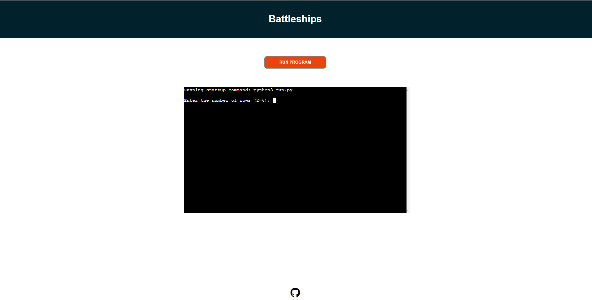

# Incorrect input
Should they input an invalid vlaue for their column and rows values, this will create a message saying so:
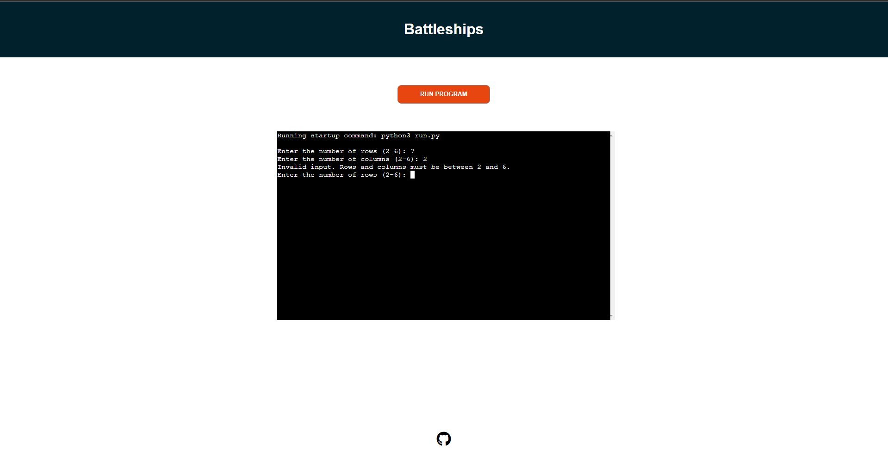

Correct values can be input:
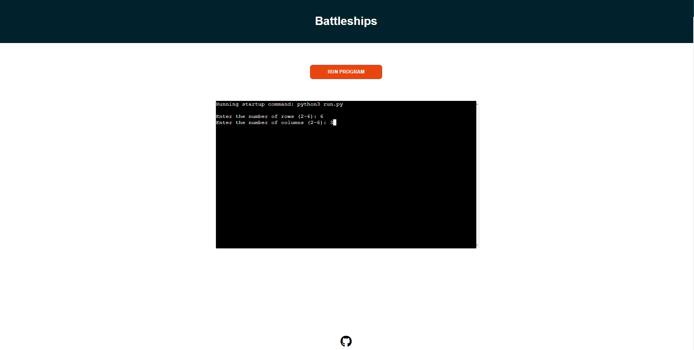

different grid sizes can be chosen from 2x2 to 6x6
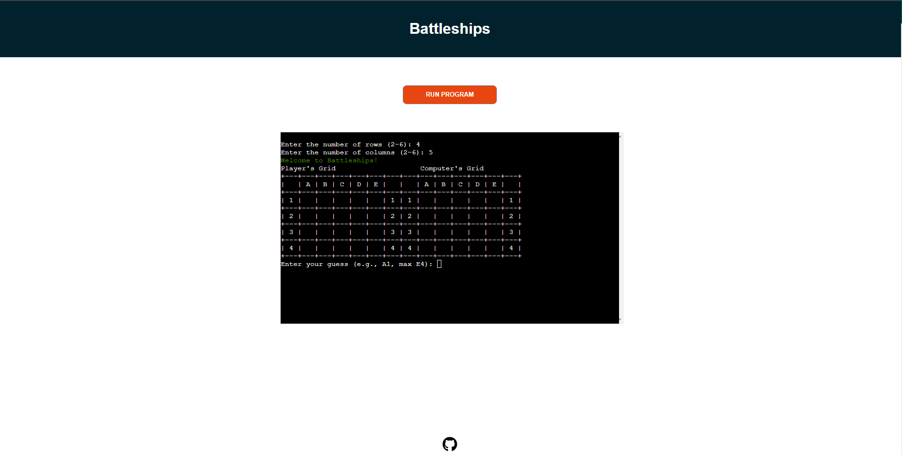
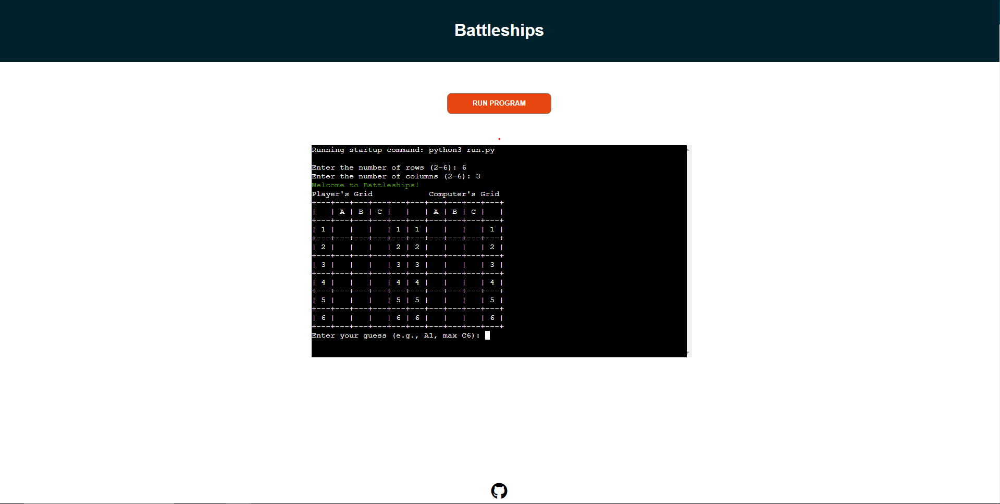

Guesses are made by typing in the terminal and wrong guesses are sent a corresponding message and not accepted!
This loop will continue unless a valid input is accepted and will continue to reject and invalid choice. Typing restart can also be used to restart the game to exit from this loop
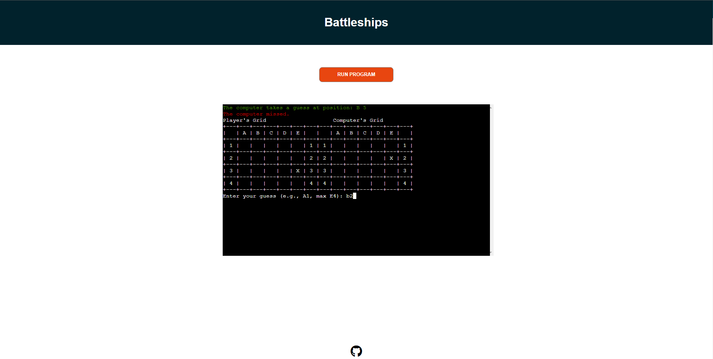
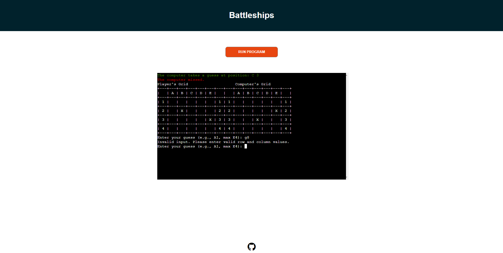
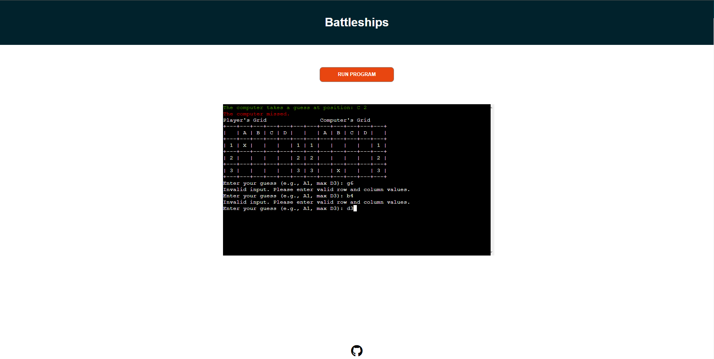

when playing the game guess are made in turns and the board is cleared after each turn to reduce clutter using the os terminal clear
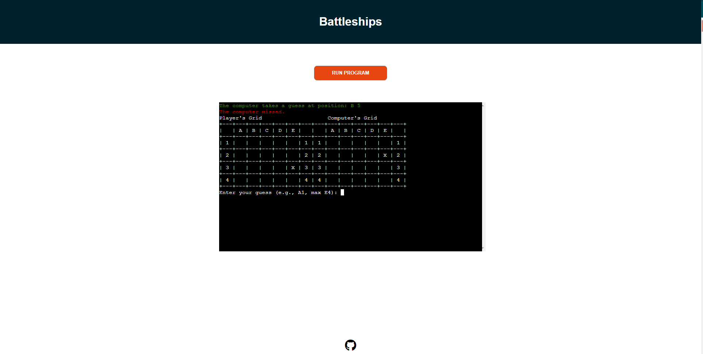
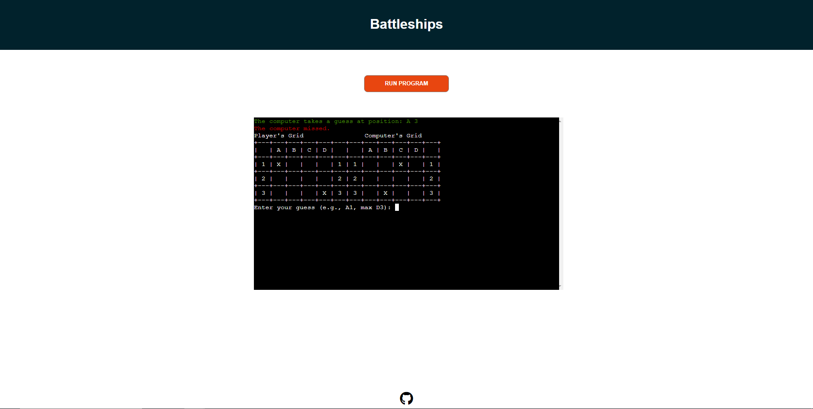

When either the player guesses correctly or the computer guesses correctly, a message will show that you have either won or lost respectively and you will be given the option to restart the game
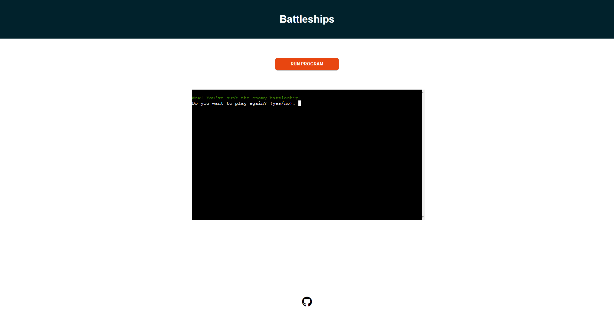
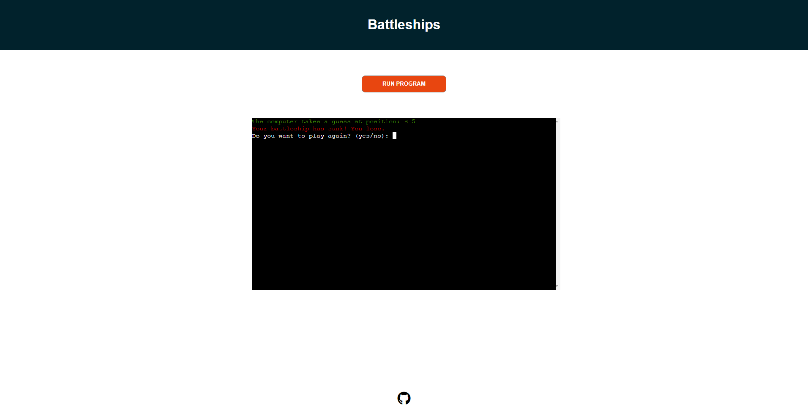
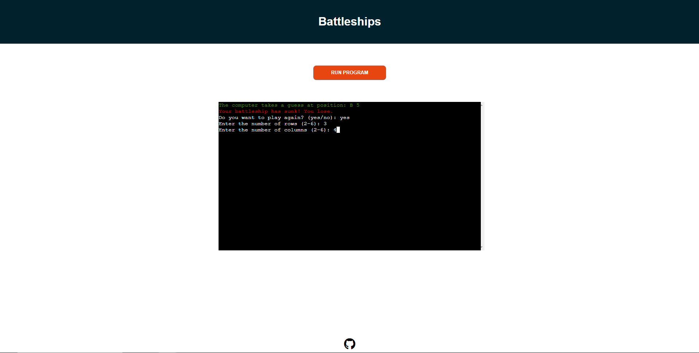

## Validation
The PEP8CI app was used to lint the code to ensure that everything is within standard. 
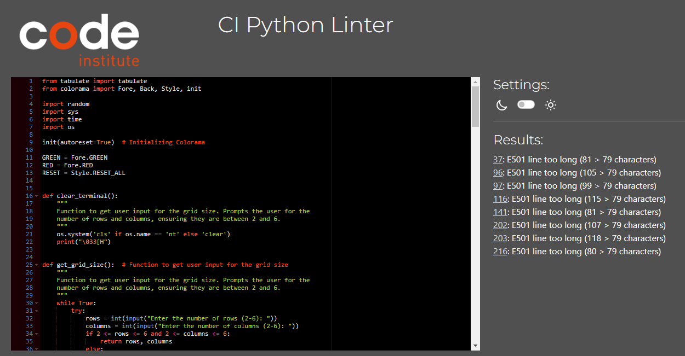

This shows that the module was relatively clear with the only errors found were a couple of warnings due to line length. Although this does not affect the functionality of the program, I understand this could cause issues with the long term sustainability of the program as the editing of the program could be harder with some of the longer line lengths.

## Accessibility

Using the lighthouse tool, it can be seen that the page shows high levels of accessibility for users. Althought the performance score is low. This may be due to inbuilt delays within the tool after clearing board which occurs frequently in order to allow for slower pcs to not experience issues when loading the grids.

## Issues
- The main issue during creation of the program was the clearing function. Within the CodeEverywhere codespace, the terminal could sometimes not clear all the items within the terminal when the function was called. However after changing terminal sizes and browsing I found this was a limitation of the terminal consoles and not the code itself. Furthermore, when using grid sizes of a larger number (e.g. allowing 7 or 8 columns and rows), the grids would not successfully clear leaving parts of old grids behind. For this, the max grid size was reduced to accomodate for the clearing function.

## Possible Future Development
In the future, some possible improvements to the game would be:
- Improve the aesthetics of the website
- Add function that allows the user to select a number of battlships and have battleships of different sizes
- create a table that gives data on the number of turns that a player won the game in which shows their grid size as well
- make the game multiplayer

## Dependencies

- tabulate: A Python library for formatting tables in the console.
- colorama: A library for adding colored output to the terminal.
- os: built in python module to clear terminal.
- random: Built in python module used to generate random battleship placements.
- time: built in python module used to allow for a 1 second buffer after clearing terminal so that page doesnt create faster than is cleared.

## Software
- Github - Used to publish repository
- Heroku - Used to deploy project
- Miro - used to create a flow diagram
- CodeAnywhere - Used to write the app
- PEP8 CI tool - Used to check the validity of the python code written
- Font Awesome - Used to creat social link for github

## Languages:

- Python
- Markdown

## Credits:
- Mentor Spencer Bariball - Helped with showing the use of the os terminal clear
- Code Institute Learning Lessons - main bulk of the python used
- StackOverflow
- W3Schools

Have fun playing Battleships!
