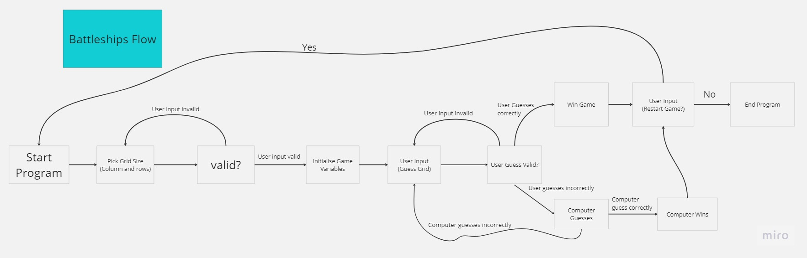

# Battleships Game

This is a command-line implementation of the classic Battleships game. The game features a player grid and a computer grid, and players take turns guessing the locations of each other's ships.

## Dependencies

- `tabulate`: A Python library for formatting tables in the console.
- `colorama`: A library for adding colored output to the terminal.

## Introduction
The Battleships game is a game that guesses where the opposing player, a computer in this case, has their battleship before they find yours. This game randomely selects battleship positions so that the game is not the same each time and allows for the user to select their grid size for more difficult games.

## User Goals
The site user wants to spend time to play a logic game to predict the position of the opposing battleship before the computer can find theirs.

## Site Owner Goals
Create a game that is simple and easy to use that allows for the user to spend their time to pick and choose their size of grid and play a game that does not end with the same result each time.

## Site Structure
The site consists of a plain

## Flowchart
The flow chart below illustrates the flow of the program decided by the inputs made by the user.

Have fun playing Battleships!